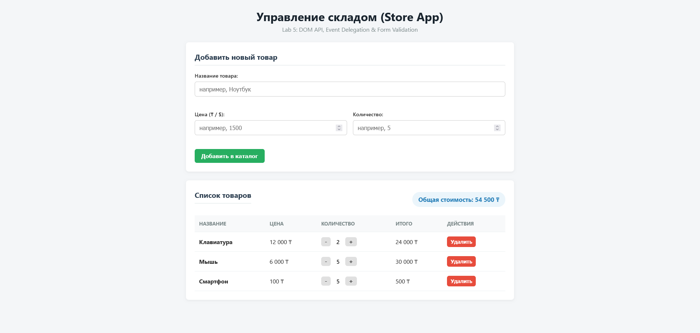

# dom-store-timuruly

# Store App — Lab 5 (DOM, events, forms)

## How to open
To run the application, open `index.html` in any web browser (no build tools or local server required).

## Handled Events and Rationale
1. `submit` on `#productForm`: Handled to process product addition, prevent default page reload (`e.preventDefault()`), and trigger in-browser field validation.
2. `click` on `#productList` (Event Delegation): Handled via a single listener attached to the `<tbody>` container. It detects button clicks (`delete`, `increase`, `decrease`) using `e.target.dataset.action` and updates the `Store` state efficiently without placing individual event listeners on every table row.
3. `input` on Form Fields: Handled on input elements (`#productName`, `#productPrice`, `#productQty`) to clear field-level validation errors dynamically as the user corrects their input.

## Application Screenshot

## AI Tools Used: Gemini
